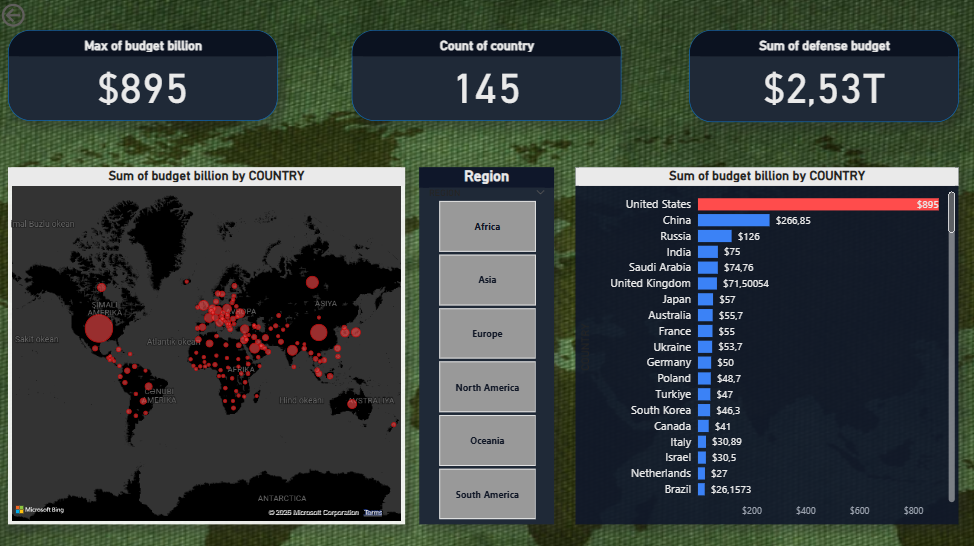
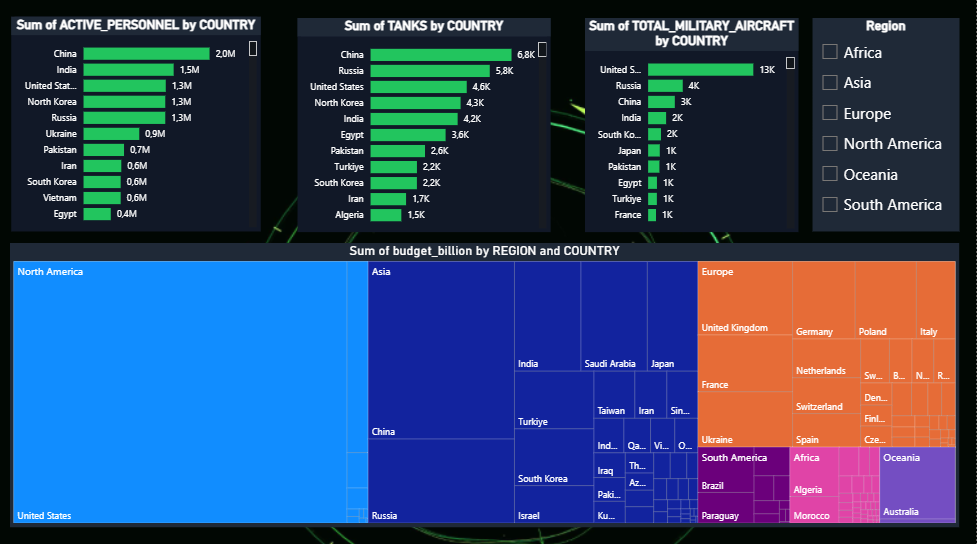
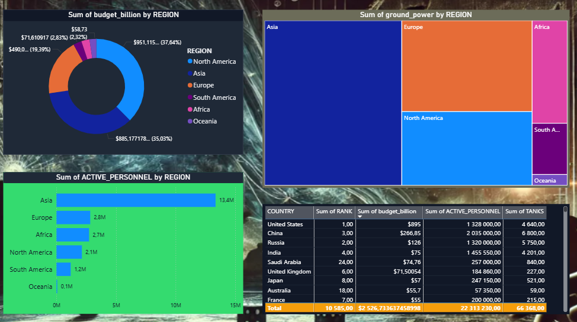

# 🌍 Global Military Power Analysis

## 📌 Haqqında
145 ölkənin hərbi gücü SQL və Power BI ilə analiz edilib.

## 🛠️ Texnologiyalar
- SQL (Oracle) — 10+ analitik sorğu
- Power BI — 3 səhifəlik interaktiv dashboard

## 📊 Dashboard səhifələri
- **Overview** — Dünya xəritəsi, TOP 10 büdcə
- **Military Power** — Qoşun, tank, təyyarə müqayisəsi  
- **Regional Analysis** — Region üzrə güc bölgüsü

## 📁 Dataset
- 145 ölkə, 57 göstərici
- Mənbə: Global Firepower 2025

## 🔗 Əlaqə
[LinkedIn](https://www.linkedin.com/in/babek-babayev-2a2aa6281/)

### 📊 Dashboard Görünümü
#### 🌍 1. Overview (Qlobal Baxış və Əsas Metriklər)

#### 🛡️ 2. Military Power (Hərbi Güc və Arsenal Müqayisəsi)

#### 📍 3. Regional Analysis (Regionlar üzrə Güc Bölgüsü)

